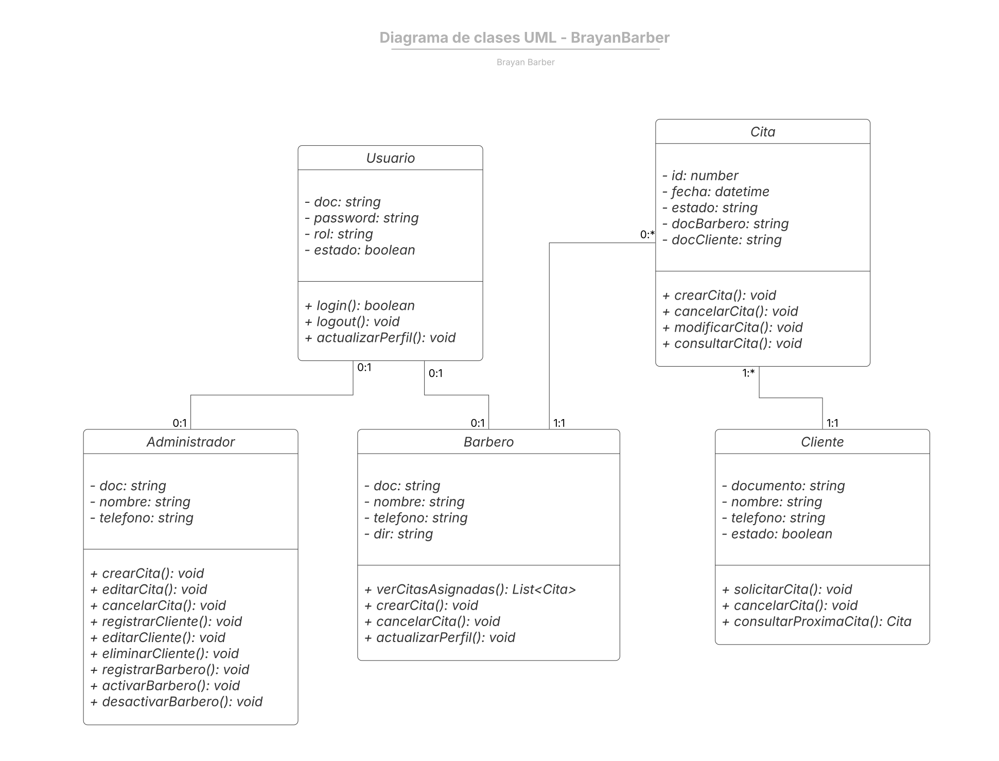

# ✂️ Brayan Barber

Lea detenidamente la documentación para la ejecución del proyecto. 

**Objetivo General:** Desarrollar e implementar una aplicación web para la gestión de citas, clientes y empleados de la barbería “Brayan Barber”, que permita centralizar la información y organizar la operación del negocio, logrando reducir los errores en el agendamiento en al menos un 80% durante el primer mes de uso.

**Objetivos Específicos:**

1. Diseñar e implementar un módulo de gestión de citas que permita crear, editar, cancelar y visualizar reservas, garantizando la disponibilidad de horarios y evitando conflictos de agenda.

2. Desarrollar un módulo de registro de clientes que permita almacenar y consultar información básica, logrando que al menos el 90% de los clientes frecuentes queden registrados al primer mes de uso.

3. Implementar un módulo de gestión de empleados que permita registrar, activar y desactivar barberos, garantizando la correcta asignación de citas durante el periodo de prueba del sistema.

4. Establecer un sistema de roles (administrador y barbero) que controle el acceso a las funcionalidades del sistema, garantizando que cada rol interactúe únicamente con las opciones correspondientes.

## Diagrama de Clases


## Requisitos
1. Visual Studio 2022
2. .NET Framework 8.x
3. NPM 11.9.0
4. NodeJS v24.14.0

## Paso a Paso para Descargar NodeJS y Componentes del Frontend VS 2022

[React Project in Visual Studio 2022](https://www.youtube.com/watch?v=qBSFHEra5P0)

## Tecnologías
- React 18
- Vite
- React Router DOM v6
- Axios
- TailwindCSS v3
- Lucide React
- .NET Framework (C#)


## Instalación Librerías Frontend

Este proceso solo se ejecutará tiene una versión de Visual Studio inferior o superior a la 2022.

```
Paso 1. Abrir PowerShell como Admin
Paso 2. Ubicarte en la carpeta del frontend
Paso 3. Lanzar el comando: Set-ExecutionPolicy RemoteSigned -Scope CurrentUser

Paso 4. Instalación de librerías:
npm install react-router-dom axios lucide-react
npm install -D tailwindcss@3 postcss autoprefixer
npx tailwindcss init -p
```

En el caso que tenga Visual Studio 2022 solo ejecute el archivo .sln

## Estructura Frontend
```
src
 ├── assets
 ├── components
 │    ├── Navbar
 │    ├── Footer
 │    ├── AppointmentCard
 │    ├── FormInput
 │    └── ProtectedRoute
 ├── pages
 │    ├── public
 │    │    ├── Home
 │    │    ├── BookAppointment
 │    │    ├── MyAppointment
 │    ├── auth
 │    │    └── Login
 │    ├── barber
 │    │    ├── BarberDashboard
 │    │    ├── BarberAppointments
 │    │    └── BarberProfile
 │    ├── admin
 │    │    ├── AdminDashboard
 │    │    ├── AdminAppointments
 │    │    ├── Employees
 │    │    └── Clients
 │
 ├── services
 │    └── api.js
 ├── context
 │    └── AuthContext.jsx
 ├── routes
 │    └── AppRoutes.jsx
 └── App.jsx
 ```

 ### Construcción del Backend

 ## Estructura Backend

 ```
 ├───BrayanBarber.API
│   │   appsettings.json
│   │   Program.cs
│   ├───Controllers
│   ├───DTOs
│   │   ├───Request
│   │   └───Response
│   ├───Mappings
│   │       MappingProfile.cs
│   │
│   ├───Middlewares
│
├───BrayanBarber.DataAccess
│   │   BrayanBarber.DataAccess.csproj
│   ├───Context
│   │       BarberDbContext.cs
│   ├───Migrations
│   ├───Repositories
│   └───Seeders
└───BrayanBarber.Domain
    ├───Entities
    ├───Enums
    ├───Helper
    ├───Interfaces
    │   ├───Repositories
    │   └───Services
    └───Services
 ```

```
dotnet new sln -n BrayanBarber
dotnet new webapi -n BrayanBarber.API -controllers
dotnet new classlib -n BrayanBarber.Domain
dotnet new classlib -n BrayanBarber.DataAccess

dotnet sln add BrayanBarber.API/BrayanBarber.API.csproj
dotnet sln add BrayanBarber.Domain/BrayanBarber.Domain.csproj
dotnet sln add BrayanBarber.DataAccess/BrayanBarber.DataAccess.csproj

# API referencia a Domain
dotnet add BrayanBarber.API/BrayanBarber.API.csproj reference BrayanBarber.Domain/BrayanBarber.Domain.csproj

# API referencia a DataAccess (para registrar servicios en Program.cs)
dotnet add BrayanBarber.API/BrayanBarber.API.csproj reference BrayanBarber.DataAccess/BrayanBarber.DataAccess.csproj

# DataAccess referencia a Domain
dotnet add BrayanBarber.DataAccess/BrayanBarber.DataAccess.csproj reference BrayanBarber.Domain/BrayanBarber.Domain.csproj
 ```

 #### Paqueteria

```
cd BrayanBarber.DataAccess
dotnet add package Microsoft.EntityFrameworkCore -v 8.0.*
dotnet add package Microsoft.EntityFrameworkCore.SqlServer -v 8.0.*
dotnet add package Microsoft.EntityFrameworkCore.Tools -v 8.0.*
dotnet add package BCrypt.Net-Next

cd BrayanBarber.API
dotnet add package Microsoft.EntityFrameworkCore.Design -v 8.0.*
dotnet add package AutoMapper.Extensions.Microsoft.DependencyInjection
dotnet add package Swashbuckle.AspNetCore

cd BrayanBarber.Domain
dotnet add package Microsoft.Extensions.Logging.Abstractions
dotnet add package BCrypt.Net-Next
```